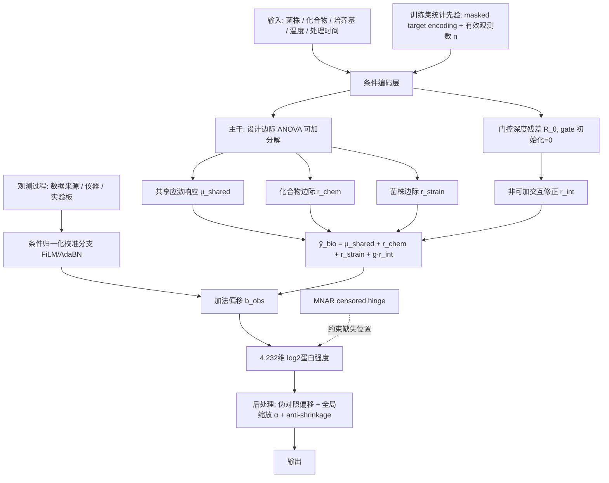
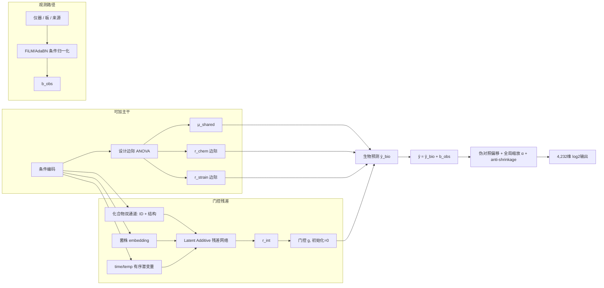
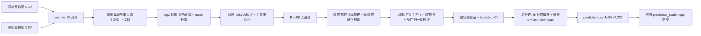

# 基于可加分解主干与门控残差的酿酒酵母虚拟细胞条件响应预测
### —— 兼顾 MNAR 删失建模与跨轴几何 OOD 诊断

## 一、项目概述

### 1.1 项目名称

**基于可加分解主干与门控残差的酿酒酵母虚拟细胞条件响应预测**

> 本方案的架构取舍建立在对历年获奖「虚拟细胞 / 扰动响应预测」方案的系统调研之上（8 个同构竞赛与基准，
> 详见 `docs/report.md`）。调研的核心结论是：
> **这不是一个靠架构规模取胜的赛题，而是靠「正确的分解 + 正确的损失 + 正确的 CV + 正确的缺失机制处理」取胜的赛题。**

### 1.2 参赛方向

赛道三·虚拟细胞方向（基于酵母扰动蛋白质组数据的条件响应预测）。我们选择**封闭数据榜**作为初赛主战场：封闭榜仅使用组委会发布的训练数据、字段字典与官方基线，不依赖外部数据库匹配，能够在数据发布后的最短时间内完成端到端验证与迭代。开放知识榜所需的菌株基因组（Peter et al. 2018）、化合物 SMILES（PubChem/ChEMBL）与蛋白先验（GO/KEGG/STRING）映射方案已在 3.3 节作为复赛/决赛扩展路径列出；两个榜分别评分，我们以封闭榜为初赛主要投入，复赛视实体匹配成熟度决定是否切换开放榜。

### 1.3 方案概述

本方案面向的问题是：在仅给定菌株、化合物和培养条件的情况下，直接预测酵母细胞经扰动后 4,232 个蛋白的 log2 强度向量。任务不输入 control 样本，因此模型必须真正学到跨条件的响应规律，而非记忆对照—处理映射。

我们采用**两段式架构**：以**设计边际 ANOVA 可加分解**为主干 `B`，以**门控初始化为 0 的深度残差模块** `R_θ` 为修正项，输出 `ŷ = B + R_θ`。这一取舍来自跨三个独立基准的一致证据——当前所有深度模型学到的基本就是可加的平均效应，非可加互作项几乎没学到（Systema, *Nat Biotechnol* 2025；PerturBench, arXiv:2408.10609；Ahlmann-Eltze et al., *Nat Methods* 2025）。门控初始化为 0 意味着模型从「等价于强基线」出发，只在有统计证据时才偏离，从而把「深度模块是否真的有用」变成一个可检验的命题，而非默认假设。

围绕这一主干，我们组织七个协同模块：**① 可加分解主干 + 门控残差**（对齐占 65% 权重的 Δ 类指标）；**② 化合物双通道表征 + 有序条件编码**（ID 通道拟合已见的 38 个训练化合物，结构/靶点通道负责泛化到 6 个验证 + 11 个测试化合物；time/temp 作有序潜变量而非 one-hot。封闭榜下结构通道受数据合规限制，实现方式见 3.1.5 创新点 2）；**③ 条件归一化式批次校准分支 + 伪对照锚点**（把观测过程显式建模为条件变量而非对抗抹除）；**④ 三层加权 mask-aware 多目标 loss**（官方六模块加权公式逐项写进损失）；**⑤ 全局缩放校准与 anti-shrinkage 后处理**；**⑥ MNAR censored hinge loss**（针对蛋白组左删失缺失机制，这是与转录组出身方案的根本差异面）；**⑦ 跨轴几何 OOD 诊断**（建模前预判四个验证场景的难度排序，并在选型阶段用 bootstrap CI 判定显著性）。

整个路线以**六条强制基线（B1~B6）**为对照，其中 **B6 是「去掉化合物输入」的崩溃探针**——因为本赛题是 decoder-only 且无 control 输入，与 PerturBench 中 `Decoder(Cov)` 的失败设定结构一致（拟合指标漂亮但排序指标随机），我们必须假设自己默认处于该陷阱中并主动检测。分阶段验证，每阶段失败均可回退到上一稳定版本。



上图呈现了方案的最终结构：生物条件先经**可加主干**得到强基线预测，门控残差只负责非可加部分；观测过程只进入校准分支，以加法形式合并；缺失位置由 censored hinge 项施加单边约束（预测高于检测限才罚），把「低于检测限」从损失转为可利用的监督信号。这种分离的稳定性在于：若评测时仪器分布与训练不同，校准分支的偏移会被重新估计而生物路径不受影响；若门控残差在小样本 OOD 上不收敛，`g → 0` 会自动退回可加主干，性能下限被锁死在 B3 基线水平。

---

## 二、科学问题理解

### 2.1 科学问题与研究对象

酿酒酵母（*Saccharomyces cerevisiae*）是研究真核细胞分子机制的经典模式生物：遗传操作成熟、培养成本低廉、无伦理限制，且其蛋白质组功能注释相对完整。本赛题把它作为“最小可行真核细胞”，检验 AI 能否在跨菌株、跨化合物、跨培养条件的设置下，预测扰动后的蛋白组响应。核心科学问题可表述为：给定一个训练时未必见过的（菌株，化合物，上下文）组合，模型能否推断出该组合诱导的 4,232 维 log2 蛋白强度向量？

任务的难点不在于“拟合一条回归曲线”，而在于**小样本、高维、实体级零样本外推**。下表从教程原文提取了关键数字，用以量化这一难度边界：

| 维度 | 数值 | 含义 |
|---|---|---|
| 菌株数 | 6（4 训练 / 1 验证 / 1 测试） | 实体级零样本泛化的核心维度 |
| 化合物数 | 55（38 训练 / 6 验证 / 11 测试） | 最大扰动维度，响应预测主体 |
| 培养基 × 温度 | 2 × 2 | 上下文变化，诱导背景差异 |
| 处理时间点 | 6（如 2h/6h/12h/24h/48h/72h） | 时间外推子任务 |
| 训练样本数 | 5,920（含处理、对照与质控） | 小样本场景 |
| 验证样本数 | 3,038（四场景合计） | 正交划分，非随机切分 |
| 最极端验证场景 | val_both = 269 | 双重零样本，试金石 |
| 输出蛋白维度 | 5,243 → 4,232（过滤 ≥80% 缺失） | 高维输出，约 20% 蛋白高缺失 |
| 缺失率 | 过滤前约 20% | 必须使用 mask-aware 训练 |

从表中可以读出两个关键判断。第一，真正的瓶颈不是回归拟合能力，而是**如何在 5,920 个样本上稳定外推到 269 个双重未知样本**。第二，约 20% 的高缺失率意味着缺失机制本身携带信息（仪器灵敏度、蛋白丰度），不能简单填 0 或均值，否则会破坏 log2 强度分布并引入虚假信号。因此，方案必须在数据层、模型层、评估层同时做稳定性设计。

### 2.2 科学意义

**应用价值**：如果模型能够可靠预测菌株—化合物组合的蛋白组响应，研究者可以在湿实验前优先筛选高价值组合，缩小实验空间，加速菌株改造、药物靶点发现与抗逆性研究。酵母是工业微生物与真核机制研究的桥梁，方法论成熟后可直接迁移到人类细胞系与药物筛选场景。

**方法价值与可迁移性**：本任务同时包含高维连续输出、系统性缺失、批次效应与实体级 OOD 泛化，是比随机训练—测试切分更接近真实科研使用场景的问题。我们在这里验证的“可加分解主干 + 门控残差 + 观测过程隔离 + MNAR 感知训练”范式，对单细胞扰动预测、蛋白质组剂量响应预测、化合物 MoA 预测等同构任务均具有可迁移性。

**与已有工作的边界**：虚拟细胞的概念演进经历了三个阶段——早期手写动力学方程描述细胞、AI 虚拟细胞概念提出、第一届虚拟细胞挑战赛以转录组响应预测为对象。本赛题把预测对象从转录组推进到**蛋白质组**，把泛化场景从单一细胞背景推进到**多菌株、多培养基、多温度的正交组合**。这意味着模型不能只学习“某化合物如何扰动某细胞系”，而必须学习“化合物结构—菌株遗传背景—上下文条件”三者如何共同决定蛋白响应。

**领域现状的清醒判断（决定我们不做什么）**：近两年的独立评测给出了高度一致的负面结论——Ahlmann-Eltze、Huber & Anders（*Nature Methods* 2025, DOI 10.1038/s41592-025-02772-6）发现 scGPT / scFoundation / GEARS 等单细胞基础模型在未见扰动预测上**均未稳定超越简单线性基线**，表现最好的配置是「线性模型 + 预训练扰动 embedding」；Systema（*Nature Biotechnology* 2025, DOI 10.1038/s41587-025-02777-8）报告条件边际均值（perturbed mean, 0.70）反而优于 GEARS（0.65）与 scGPT（0.62），而 CPA 在未见扰动上仅 0.02；scPerturBench（*Nature Methods* 2025, DOI 10.1038/s41592-025-02980-0）同样发现 GEARS 在真正的未见基因 OOD 上不敌均值基线。蛋白组侧完全同构：跨 7,852 条完整 workflow 的枚举基准中，`limma` 这一经典线性方法稳居前 4（*Nat Commun* 2024, DOI 10.1038/s41467-024-47899-w）。

因此，本方案**刻意不押注大规模预训练表征作为主干**，而是把它降级为可选的化合物结构通道；把建模重心放在**显式可加分解、损失函数与评测口径对齐、缺失机制的正确处理**这三件被反复验证有效、却常被忽视的事情上。这不是保守，而是对现有证据的诚实响应——同一批研究也指出「复杂模型不随数据规模变好，简单模型才会」。

**我们的差异化定位（两处）**：
1. **MNAR 删失建模**：蛋白组的缺失是真正的未观测且以左删失（MNAR）为主，与转录组的 dropout 零值有本质区别。绝大多数虚拟细胞方案出自转录组背景，直接套用 masked MSE 会系统性高估低丰度蛋白。我们把这一机制显式建模为损失项。
2. **跨轴几何 OOD 诊断**：我们在前置方法学研究中建立了「五轴 OOD taxonomy + 共享 PCA 主角度探针 + bootstrap 显著性判定」的评测协议，可在建模前预判不同 OOD 场景的相对难度，从而合理分配算力与建模重心（详见 3.1.5 创新点 7）。

---

## 三、技术方案与预期方法路线

### 3.1 技术方案

#### 3.1.1 任务形式化

每个样本由元数据 `sample_ID` 唯一标识，输入条件为五元组：

```
输入：菌株 strain + 化合物 chemical + 培养基 medium + 温度 temperature + 处理时间 time
输出：4,232 维 log2 蛋白强度向量 ŷ_treat
```

评测服务器持有真实对照 `y_control`，自动计算 `Δ_pred = ŷ_treat − y_control` 与 `Δ_true = y_treat − y_control`，然后计算 PCC、R²、方向准确率等指标。参赛者只需预测绝对丰度 `ŷ_treat`，并声明 `prediction_scale=log2`。

#### 3.1.2 我们的方案架构

方案的骨架是一个**两段式预测器**：

```
ŷ_bio = B(设计边际 ANOVA 可加主干)  +  g · R_θ(门控深度残差)
ŷ     = ŷ_bio + b_obs(条件归一化校准偏移)
```

其中门控标量 `g`（或逐蛋白门控向量）**初始化为 0**。训练开始时模型严格等价于可加主干；只有当残差模块在验证集的**残差类指标**上产生可测增益时，`g` 才会被梯度推离 0。

在此骨架上组织七个模块，取舍逻辑如下：

- **选择「可加主干 + 门控残差」而非端到端 MLP，也不是纯残差分解**：端到端 MLP 把共享背景、化合物效应、菌株效应混在黑箱里，无法显式优化占 65% 权重的 Δ 类指标。但更重要的是，跨基准证据显示**深度模型实际学到的就是可加平均效应**——既然如此，就应当把可加部分交给一个不会过拟合、不需要训练的闭式统计估计（设计边际 ANOVA），把深度模型的容量全部留给非可加互作，并强制它证明自己。这一结构的直接好处是**性能下限被锁死在 B3 基线水平**：即使残差模块在 269 个 val_both 样本上完全失效，`g → 0` 也只是退回强基线，而不是崩盘。

- **选择化合物双通道表征，而非单一 ID embedding**：55 个化合物中有 11 个只出现在测试集。ID embedding 对未见化合物必然退化。chemCPA 的教训与 CPA 在未见扰动上 0.02 的灾难性结果共同说明，**化合物泛化只能靠结构**。因此 compound 侧设两条通道：ID embedding（拟合已见 38 个）+ 结构/靶点 embedding（泛化未见 11 个），二者以残差方式叠加而非拼接，使得结构通道在已见化合物上只需学习「ID 通道解释不了的部分」。

- **选择条件归一化（FiLM/AdaBN）而非对抗抹除**：蛋白质组数据未经标准化，不同质谱仪器对同一蛋白存在系统性检测偏好。两条独立证据指向同一做法——RxRx1 冠军方案中 `AdaBN[domain=plate]` 单招把验证准确率从 40% 提升到 70%，而 PerturBench/CPA 的消融显示**去掉对抗判别器反而更好**。因此我们把观测过程显式建模为条件变量（在最细可行域上重估归一化统计量 + 输出加法偏移 `b(data_source, instrument, plate)`），而不是用梯度反转去「消灭」它。

- **选择多层次 mask-aware 多目标 loss，而非单一 mask-aware MSE**：单一 MSE 只优化绝对丰度，无法对齐 FC 方向与残差结构。我们把官方六模块加权公式**逐项写进损失函数**——这是 Arc VCC 2025 中与架构无关却收益最大的操作（第 3 名 TransPert 完全不用神经网络，仅靠指标对齐 + 缩放校准，总分只落后冠军 1.4 分）。同时采用 OpenVaccine 验证过的**三层正交权重**（列权重 / 元素级 mask / 样本权重）。

- **选择 MNAR censored hinge 而非任何填补**：详见创新点 6。



上图细化了数据流：可加主干给出强基线，门控残差只在有证据时介入，观测路径只输出加法偏移。设计的正确性在于评测指标中的 Δ 是对照相减后的相对变化——校准分支稳定绝对丰度，可加分解直接优化相对变化；稳定性在于三重回退路径：残差模块失效则 `g→0` 退回主干，校准分支失效则纯生物路径独立输出，后处理失效则关闭校准直接提交主干预测。

#### 3.1.3 特征工程

我们选取的特征体系如下表所示，每一类都对应一个具体的泛化或稳定性问题：

| 特征类别 | 具体实现 | 解决的问题 |
|---|---|---|
| 条件 embedding | 菌株、化合物、培养基的可学习 embedding | 为已见实体学习隐式相似性 |
| **化合物结构通道** | 封闭榜：官方元数据可导出的化合物属性；开放榜：ECFP4 指纹 + 人工 MoA（可升级 ChemBERTa / MolFormer） | **未见 11 个化合物的唯一泛化路径**；OP2023 中 ChemBERTa 是唯一成功的外部预训练（详见创新点 2 的封闭/开放榜差异说明） |
| **有序条件潜变量** | time(6) / temperature(2) 用有序潜变量（Biolord 式）或连续缩放，**禁用 one-hot** | 避免时间维出现不合理的非单调抖动；服务时间外推子任务 |
| 条件交叉特征 | strain×medium、chemical×temperature 的 hash/one-hot | 显式建模上下文调制，减少隐层学习负担 |
| **多轴 masked target encoding** | per-strain / per-compound / per-(medium,temp) 的蛋白均值与分位数，**全部 mask-aware 计算** | OP2023 冠军的核心胜负手：把目标统计量当输入特征 |
| **有效观测数 n** | 每个 target encoding 统计量附带其有效样本数 | 让模型知道该统计量有多可信，避免对稀疏条件的统计噪声过度自信 |
| **缺失模式特征** | per-protein 检出频率、per-sample 检出数、条件级缺失率 | 缺失本身携带「低于检测限」的生物信号（MANNERS/SHIFT 证据），不是纯粹的损失 |
| 观测过程特征 | 数据来源、仪器、实验板的 embedding | **仅输入条件归一化校准分支**，不参与生物编码 |
| 蛋白共表达正则 | 训练集蛋白间 Pearson 相关矩阵（mask-aware 成对完整计算） | 约束预测向量结构，降低高维过拟合 |

**关键纪律**：
1. 所有统计先验（target encoding、蛋白相关性矩阵）**仅用训练行计算**，且分母按 mask 归一化而非按维度数。对验证/测试中的新菌株或新化合物，统计先验不存在，此时用全局均值或基于结构通道相似度的最近邻均值替代。
2. **target encoding 必须配合 30% 特征 dropout 使用**（OP2023 冠军做法），否则模型会过度依赖统计量而不学条件间的规律，在 OOD 场景上崩塌。
3. **严禁在原始强度尺度上做任何填补或加伪计数**——MS 强度近似 log-normal，在原始尺度填补会引入额外偏差；伪计数的大小会直接决定低值区的 fold change，对 log2 是灾难。

#### 3.1.4 稳定性设计

我们用“数据层 / 模型层 / 评估层”三层防护表来系统管理风险：

| 层级 | 措施 | 目的 |
|---|---|---|
| 数据层 | ① 以 `sample_ID` 为唯一键对齐元数据与蛋白矩阵；② 仅用训练行计算缺失率并过滤 ≥80% 缺失蛋白；③ 保留 mask 矩阵，**全流程不填补**；④ log2 转换（不加伪计数）；⑤ **MNAR 诊断前置**：画「per-protein 检出频率 vs 平均强度」散点，正相关即确认左删失；⑥ 对照/质控样本独立管理 | 防止行顺序错位、测试信息泄漏、NA 错误填 0、尺度错误、**误用 MCAR 假设** |
| 模型层 | ① 门控 `g` 初始化为 0，残差组件可独立冻结；② BatchNorm/AdaBN + Dropout + 30% 特征 dropout；③ 早停（验证 loss 连续 10 epoch 不下降则停）；④ **GroupKFold 主分组键为 `chemical`**，辅以 `(strain, chemical)` 组合分桶；⑤ 多 seed 平均与预测值 clipping | 防止过拟合、**防止同化合物跨 fold 泄漏**（MoA 赛的 drug_id 泄漏是全榜单 CV 失效的直接原因）、支持组件回退 |
| 评估层 | ① 四验证场景分别报告；② 每次与 **B1~B6 六条基线**逐一对比（见 3.2 阶段 0）；③ **内部指标必须含排序类**：`rank_average`、top-k DEP recall、残差相关性；④ 对关键指标做 **bootstrap over conditions 的 95% CI，CI 跨 0 即淡化结论**；⑤ 消融实验（embedding shuffle、组件移除、门控强制置零）；⑥ 把「本地 CV 与线上排名的一致性」当作流程正确性的核心 KPI | 防止大样本场景掩盖小样本失败、**防止 Decoder(Cov) 式崩溃被拟合指标掩盖**、防止不可解释提升 |

**排序类指标的必要性说明**：PerturBench 构造过一个不输入任何扰动信息、只用协变量的 `Decoder(Cov)` 模型，其 RMSE 与 Cosine 都很好看，但 `rank_average ≈ 0.47`（0.5 为完全随机）——即模型完全没学到扰动，却能骗过所有拟合类指标。本赛题是 decoder-only 且无 control 输入，与该失败设定结构一致，因此**只看 RMSE / Global R² 是不充分的**，必须以排序类指标作为交叉验证的主判据之一。

#### 3.1.5 我们的创新设计

下面按“领域现状与不足 → 我们的差异设计 → 对应评测模块 → 消融验证设计”展开每个创新点，并说明它们之间的逻辑自洽性。

**创新点 1：可加分解主干 + 门控深度残差**

- 领域现状与不足：现有蛋白质组条件响应预测多采用端到端回归，把共享背景与特异响应混在一起。更根本的问题是，跨 Ahlmann-Eltze / Systema / PerturBench 三个独立基准的一致结论显示，**深度模型实际学到的基本就是可加的平均效应，非可加互作项几乎没学到**——Systema 中条件边际均值（0.70）反而击败 GEARS（0.65）与 scGPT（0.62）。因此把可加部分也交给深度网络去学，是把容量浪费在一个统计估计就能做得更好的地方。
- 我们的差异设计：把预测拆为 `ŷ_bio = μ_shared + r_chem + r_strain + g·r_int`。前三项由**设计边际 ANOVA 闭式估计**给出（不训练、不过拟合）：`μ_shared` 对应上下文（培养基、温度、时间）的公共应激；`r_chem` 是化合物边际效应；`r_strain` 是菌株边际效应。第四项 `r_int` 由 Latent Additive 残差网络给出，**门控 `g` 初始化为 0**，专门服务 val_both 双重未知场景。
- 关键纪律：**残差模块必须在残差类指标上单独证明增益**，而不是在全局指标上。若 bootstrap 95% CI 跨 0，则保持 `g≈0` 并如实报告——这比强行堆模型更符合评委认可的方法论标准。
- 对应评测模块：模块 1（原始 FC，25%）、模块 3（上下文均值残差，20%）、模块 4（药物均值残差，20%），合计 65%。
- 消融验证：强制 `g=0`（纯可加主干）与完整模型对比，在每个 OOD 场景上分别报告 bootstrap CI；移除 `r_chem` 后模块 3 应显著下降；移除 `r_strain` 后模块 4 应显著下降。

**创新点 2：化合物双通道表征 + 有序条件潜变量**

- 领域现状与不足：one-hot 与纯 ID embedding 对新实体全部退化为“未知类别”。chemCPA 的教训与 CPA 在未见扰动上仅 0.02 的灾难性结果共同证明，**化合物泛化只能靠结构信息**。另一方面，把 time(6)、temperature(2) 这类**有序**变量做成 one-hot，会让模型在时间维上产生不合理的非单调抖动。
- 我们的差异设计：
  - **化合物双通道**：ID embedding（拟合已见的 38 个训练化合物）+ 结构/靶点 embedding（泛化到 6 个验证 + 11 个测试化合物），二者**残差式叠加**——结构通道只学习「ID 通道解释不了的部分」，使其在已见化合物上不与 ID 通道竞争，在未见化合物上独立承担预测。
  - **封闭榜 / 开放榜的通道实现差异（必须明确区分）**：结构通道需要化合物的分子表征，而封闭榜只允许使用组委会数据。因此：
    - **封闭榜**：结构通道退化为「**官方元数据可导出的化合物属性通道**」——仅使用组委会提供的字段（如 `product_id`、化合物名称可解析出的类别/系列信息）构造类别相似度。若官方元数据完全不含任何可泛化的化合物属性，则**必须诚实承认：封闭榜下的 17 个未见化合物（6 验证 + 11 测试）在信息论意义上是不可辨识的**，模型对它们的最优预测就是「同上下文下的化合物边际均值」，任何超出此的表现都可能是过拟合或数据泄漏。此时我们的策略是**主动放弃在 val_chem_only 上追求超额收益，转而确保不低于 B2 基线**，把资源集中在 val_strain_only（1,547 样本，占验证集 51%）与模块 2/3 上。
    - **开放榜 / 复赛**：结构通道启用 PubChem/ChEMBL 的 SMILES → ECFP4 指纹 + 人工 MoA 标注，可进一步升级为 ChemBERTa / MolFormer。依据是 OP2023 中 **ChemBERTa on SMILES 是唯一成功的外部预训练表征**。这也是我们判断开放榜相对封闭榜有实质增益的主要来源。
  - **有序条件潜变量**：time / temperature 用 Biolord 式有序潜变量或 CPA 式连续缩放，保证时间维预测的单调性与可外推性。
  - **多轴 masked target encoding + 有效观测数 n**：把 per-strain / per-compound 的目标统计量作为输入特征（OP2023 冠军的核心胜负手），并附带其有效样本数让模型判断可信度。
- 对应评测模块：val_chem_only（1,065）、val_strain_only（1,547）、val_both（269）三大 OOD 场景 + 模块 5 的时间外推部分。
- 消融验证：关闭结构通道，观察 val_chem_only 下降幅度（预期显著）；对 ID embedding 做 shuffle，验证其被有效利用；把有序潜变量换回 one-hot，检查时间维预测是否出现非单调抖动。

**创新点 3：条件归一化式批次校准分支 + 伪对照锚点**

- 领域现状与不足：多数方案把仪器、板、来源等元数据与生物条件统一编码，导致模型把「仪器 A 测蛋白 X 偏低」学成生物规律。另一类常见做法是用对抗判别器抹除批次信息，但 CPA 的消融实验显示**去掉对抗判别器反而更好**。
- 我们的差异设计：把批次显式建模为**条件变量**而非噪声去消灭。生物条件只进入可加主干与残差网络；观测过程只进入 FiLM/AdaBN 条件归一化分支（在最细可行域上重估归一化统计量），输出加法偏移 `b_obs`。依据是 RxRx1 冠军的 `AdaBN[domain=plate]` 单招把验证准确率从 40% 提到 70%，收益大于任何 backbone 升级。
- **无 control 的补偿设计**（重要风险对冲）：RxRx1 每板固定 30 个 control 提供批次锚点，主办方称这是「赛题可解的前提」。我方**无 control 输入 = 失去该锚点 = 难度质变**。补偿手段有三：① **伪对照锚点**——用同 (strain, medium, temp, time) 下跨 compound 的中位数作为该条件的 pseudo-basal；② **`ctl1 − ctl2` 式噪声增强**——用同生物条件下不同 batch 的差作为噪声算子做数据增强（MoA 赛第 3 名的胜负手）；③ 把 **missingness pattern 作为批次指纹特征**输入校准分支。
- 对应评测模块：模块 2 绝对保真度（20%），直接影响 Global R² 与逐蛋白 R²。
- 消融验证：移除校准分支，观察 Global R² 与 per-protein R² 中位数；把观测过程字段混入生物输入，观察跨仪器子集是否崩溃；对比「条件归一化 vs 对抗抹除」两种实现。

**创新点 4：三层加权 mask-aware 多目标 loss（官方评测公式逐项写入）**

- 领域现状与不足：单一 MSE 只优化绝对丰度，对 FC 方向、残差结构、DEP 检出约束不足。Arc VCC 2025 的结果证明，**把官方加权评测公式逐项写进损失函数**这件与架构无关的事，其收益足以让一个零神经网络的纯统计方法（TransPert）总分只落后百亿参数基础模型 1.4 分。
- 我们的差异设计（两个层次）：
  - **指标对齐层**：`L = 0.25·L_fc + 0.20·L_abs + 0.20·L_ctx + 0.20·L_drug + 0.10·L_double + 0.05·L_DEP`，权重直接取自官方六模块。其中 `L_fc` 用 soft-Spearman（可微排序近似）而非 MSE，`L_DEP` 用 BCE——BCE 项的额外价值在于**在「目标≈0」处仍有梯度**（OP2023 复合损失的关键设计）。
  - **三层正交权重层**（OpenVaccine 验证过，三者叠加而非三选一）：**列权重**区分「被重点评分 vs 次要」的蛋白/指标；**元素级 mask** 区分「观测到 vs 缺失」，**分母必须按有效观测数归一化，不能按维度数**；**样本权重**按 compound/strain 出现频次降权，避免高频条件主导梯度（对应 OpenVaccine 的 `1/sqrt(簇大小)`）。
  - 另加蛋白相关性正则 `MSE(protein_corr)` 约束输出空间结构，辅助模块 6。
- 对应评测模块：全部六个模块（100%）。
- 消融验证：仅保留 mask-aware MSE，观察各 Δ 类指标下降；逐项关闭加权分量，验证每一项确实提升其对应模块；对比 soft-Spearman 与 MSE 版本的 `L_fc`。

**创新点 5：全局缩放校准 + anti-shrinkage 后处理**

- 领域现状与不足：模型预测的绝对丰度可能包含系统偏移，导致 FC 方向正确但幅度偏差。更隐蔽的是 OP3 官方复盘发现的负结果——**误差随差异表达基因数上升，即模型系统性低估强扰动**。这是高维小样本回归的固有收缩倾向，会直接损害 FC 相关性与 DEP 检出。
- 我们的差异设计：
  - **伪对照偏移校准**：预测后减去同条件伪对照均值，再加回训练集全局均值，使 FC 计算更稳定；
  - **全局/分组线性缩放 α**：用 CV 选出一个（或按 OOD 场景分组的若干）缩放因子 `ŷ ← α·ŷ`，这是 Arc VCC 三甲共有的低成本操作；
  - **anti-shrinkage 分层幅度校准**：按预测响应强度分层，对强响应层单独拟合放大系数，抵消系统性收缩。
- **保守化纪律**：在被「惩罚过度自信」的指标评分时，一切保守化都是净收益（MoA 赛结论）——预测值 clipping、多 seed 平均、多模型简单平均全部启用；融合权重按**与其它模型的预测相关性**分配，而非按单模型分数。
- 对应评测模块：模块 1 原始 FC（25%）、模块 6 DEP 检出（5%）。
- 消融验证：对比后处理前后的 FC PCC；绘制「真实响应强度 vs 预测响应强度」回归线，检验斜率是否从 <1 校正到 ≈1。

**创新点 6：MNAR censored hinge loss —— 把缺失从损失变成监督信号** ⭐

- 领域现状与不足：**这是本方案与所有转录组出身方案的根本差异面**。转录组的 0 多为 dropout 或低表达，但仍是「观测到的 0」；蛋白组的 NA 是**真正的未观测，且以 MNAR（左删失）为主**——蛋白丰度越低越容易低于质谱检测限而缺失。诊断方法极简：画「per-protein 检出频率 vs 平均强度」散点，若正相关即确认 MNAR，而文献原话是 *"In proteomics this correlation is almost always strong."* 其后果是：observed-only 的训练集在丰度上是**有偏样本**，直接用 masked MSE 训练会让模型**系统性高估低丰度蛋白**。我方 ~20% 的缺失率恰好落在 DDA 区间（~17%），属于「填补收益为正但风险最高」的地带。
- 我们的差异设计：**不填补，改为对缺失位置施加单边（censored）惩罚**。设该蛋白在该批次下的检测限估计为 `LOD_p`，则对缺失位置引入 hinge 项：

  ```
  L_censored = Σ_{(i,p) ∈ missing}  max(0,  ŷ_ip − LOD_p)²
  ```

  即：预测值若高于检测限则罚（因为若真高于 LOD 就应被观测到），低于检测限则不罚（真值在此区间内不可辨）。`LOD_p` 由该蛋白在同批次中观测值的低分位数稳健估计。这把「这个蛋白在这个条件下低于检测限」这一信息从「损失」转化为**可利用的监督信号**。依据：MANNERS 证明在 99% 缺失下 mask-aware 训练优于任何纯填补；SHIFT 证明把不完整队列纳入训练能提升完整数据上的性能。
- **配套的 log2 纪律**（写入数据处理流程）：① 严禁 mean imputation；② 严禁在原始强度尺度填补（MS 强度近似 log-normal）；③ 严禁加伪计数（其大小直接决定低值区 fold change）；④ **单侧检出蛋白（一组全有一组全无）不报 fold change**，作定性结果单列——min-shift 式填补会给出人为压低的值，产生虚高 log2FC 与假阳性 DEP。
- 对应评测模块：模块 2 绝对保真度（20%）、模块 6 DEP 检出（5%），并通过消除低丰度偏倚间接改善模块 1。
- 消融验证：① 先做 MNAR 诊断散点，确认机制成立；② 对比「纯 masked MSE」与「masked MSE + censored hinge」在低丰度蛋白子集上的 per-protein R² 与预测均值偏移；③ 对比 mean/MinDet/missForest 三种填补方案，验证不填补确实更优。
- **不确定性声明**：若诊断发现我方缺失主要是**设计缺口 MAR**（即某些条件根本没测，而非低于检测限），则 censored hinge 的前提不成立，此时退化为纯 mask-aware 训练。该诊断已前置为阶段 0 的必做动作。

**创新点 7：跨轴几何 OOD 诊断与显著性判定纪律** ⭐

- 领域现状与不足：现有方案通常把「未见化合物」「未见菌株」「双重未知」当作同质的 OOD 一视同仁，用同一套模型与同样的算力去打。但 PerturBench 与 scPerturBench 都指出「**指标选择本身就是失败源**」，而 DREAM SCSBrC 的误差异质性分析给出了更具体的证据：误差在 cell line 与 marker 上高度非均匀（ANOVA P<2.2e-16），但在 treatment 与 time 上均匀（P=0.67 / 0.68）——**难度来自「个体」而非「扰动」**。这意味着 OOD 轴之间存在结构性的难度差异，值得在建模前就量化。
- 我们的差异设计（源自本团队前置方法学研究「虚拟镜像神经元」的完整方法栈）：
  - **五轴 OOD taxonomy**：把 OOD 分解为跨批次 / 跨主体 / 未见动作 / 跨协议 / 交叉五个正交轴，而非笼统的「OOD」；
  - **共享 PCA 主角度几何探针**：在所有分组的并集上先拟合共享 PCA 降到低维流形（这一步是必需的——直接在高维效应场上做 CCA 会因稀疏性退化为构造性伪影），再计算 id 子空间与各 OOD 子空间的**主角度**，量化「机制结构在该轴上是否对齐可迁移」；
  - **bootstrap CI + 显著性判定**：所有指标以 bootstrap over conditions 报告 95% CI，采用 Ahlmann-Eltze 的呈现范式——**mean ratio vs baseline + 95% CI，CI 跨 0 就淡化结论**；选型决策辅以 Bayes factor（DREAM 冠军做法）。
- **在本赛题的具体用途**：建模前先算一遍四个验证场景相对训练分布的主角度，据此预判难度排序并分配算力与建模重心。前置研究在人单细胞扰动数据上的实测结果为：跨批次轴 ≈13°（强对齐）、跨主体轴 ≈23°（可迁移）、未见动作轴 ≈49°（近正交，结构缺失）。若该几何在酵母蛋白组上复现，则预期难度排序为 `val_both > val_chem_only > val_strain_only > val_time`。
- **「对齐 ≠ 预测优势」的诚实结论及其指导作用**：前置研究的一个关键负结果是——子空间对齐良好并不自动带来预测增益。这与本次调研中「单细胞基础模型 embedding 几乎无增益」「对抗解耦与稀疏掩码消融后反而更好」的三条独立证据同向。它直接指导了本方案的取舍：**初赛不押注预训练 embedding 作为主干，改用显式残差分解 + 统计先验**。
- 对应评测模块：不直接优化任何单一模块，而是作为**评测协议与资源分配的元层设计**，服务于全部六个模块的稳定性，并支撑科学意义与方法创新性的论述。
- 消融验证：在我方真实数据上重算主角度，检验其与四场景实测难度排序的相关性；对比「按几何诊断分配算力」与「均匀分配」两种策略的最终加权得分。
- **不确定性声明（重要）**：上述几何角度来自**人单细胞转录组**（Replogle / Norman）的实测，迁移到**酵母蛋白组**尚未验证。方案中将其定位为「**待验证先验**」——它提供的是一个可检验的假设与一套现成的诊断工具，而非已确立的结论。阶段 0 将用我方数据重算一遍主角度作为验证动作。

下表集中呈现了创新点与评测模块的对应关系：

| 创新点 | 主要对应评测模块 | 消融验证方式 |
|---|---|---|
| 1. 可加主干 + 门控残差 | 模块 1/3/4（65%） | 强制 `g=0` vs 完整模型，各 OOD 场景分别报 bootstrap CI |
| 2. 化合物双通道 + 有序条件 | val_chem / val_strain / val_both + 模块 5 | 关闭结构通道；embedding shuffle；有序潜变量 vs one-hot |
| 3. 条件归一化校准 + 伪对照锚点 | 模块 2 绝对保真度（20%） | 移除分支；观测字段混入生物输入；条件归一化 vs 对抗抹除 |
| 4. 三层加权 mask-aware 多目标 loss | 全部六模块（100%） | 单 MSE vs 多目标；逐项关闭加权分量 |
| 5. 全局缩放 + anti-shrinkage | 模块 1（25%）+ 模块 6（5%） | 后处理前后 FC PCC；响应强度回归斜率是否校正到 ≈1 |
| 6. **MNAR censored hinge loss** | 模块 2（20%）+ 模块 6（5%） | MNAR 诊断散点；低丰度子集 per-protein R²；vs 三种填补方案 |
| 7. **跨轴几何 OOD 诊断** | 元层（评测协议与算力分配） | 主角度与实测难度排序的相关性；几何指导 vs 均匀分配 |

**逻辑自洽性说明**：这七个创新点分工正交、互不冲突。创新点 1 负责「生物语义分解与容量分配」，2 负责「实体泛化」，3 负责「观测偏差修正」，4 负责「指标对齐」，5 负责「幅度精调」，6 负责「缺失机制建模」，7 负责「评测协议与资源分配」。它们可以端到端联合训练；若某组件不稳定（如交互项在 val_both 上过拟合），门控机制会自动把它推向 0，或可单独冻结/移除而不影响其他组件。

**三层回退路径**（性能下限保障）：① 门控残差失效 → `g→0`，退回可加主干（≈ B3 基线）；② 校准分支失效 → 关闭观测路径，纯生物路径独立输出；③ 后处理失效 → 直接提交主干预测。任一环节的失败都不会导致整体崩盘。

#### 3.1.6 风险与缓解

| 风险 | 后果 | 缓解措施 | 失败回退 |
|---|---|---|---|
| **⚠️ Decoder(Cov) 式崩溃**：模型未真正学到化合物效应，但拟合指标漂亮 | 线上排名远低于本地 RMSE 的预期；本质是「预测了一个平均细胞」 | ① 强制加入 **B6 崩溃探针基线**（去掉 compound 输入重训），若其分数接近正式模型即确诊；② 内部指标必须含 `rank_average` 与 top-k DEP recall；③ HPO 目标设为 `主指标 + λ·rank` | 若确诊，立即回到化合物表征侧排查（结构通道是否被利用、target encoding 是否吞掉了信号） |
| 残差交互项在 val_both（269 样本）上过拟合 | 双重未知场景预测符号错误，模块 1/5 得分低 | 门控 `g` 初始化为 0 + 单独 L2 正则；先训主干，再小学习率微调残差 | 门控自动趋 0，退回纯可加主干 |
| 批次校准分支学到生物信号 | 跨仪器泛化崩溃，模块 2 在测试集下降 | 严格分离输入：观测字段只进校准分支；采用条件归一化而非对抗（对抗判别器在 CPA 消融中被证明有害） | 直接移除校准分支，纯生物路径输出 |
| 统计先验在未见实体上失效 | 新菌株/新化合物场景预测退化为全局均值 | 结构通道（ECFP4+MoA）为未见化合物提供独立预测路径；菌株侧用上下文相似度最近邻回退 | 统计先验替换为全局均值，依赖结构通道泛化 |
| **无 control 锚点导致绝对丰度漂移** | 模块 2 绝对保真度崩塌 | 伪对照锚点（同条件跨 compound 中位数）+ `ctl1−ctl2` 式噪声增强 + missingness 指纹特征 | 接受模块 2 损失，把权重重心转移到 Δ 类指标（65%） |
| **MNAR 假设不成立**（缺失实为设计缺口 MAR） | censored hinge 引入错误的单边约束，反而伤害预测 | 阶段 0 强制做「检出频率 vs 平均强度」诊断散点；相关性弱则不启用 | 退化为纯 mask-aware 训练，创新点 6 关闭 |
| **几何先验不迁移**（人转录组 → 酵母蛋白组） | 难度预判失效，算力分配次优 | 已标注为「待验证先验」；阶段 0 用我方数据重算主角度验证 | 回退到均匀算力分配，不影响任何模型组件 |
| **CV 与线上不一致** | 本地调优方向错误，提交次数被浪费 | GroupKFold 主分组键为 `chemical`（MoA 赛的 drug_id 泄漏教训）；把「CV-LB 一致性」当核心 KPI | 一致性未建立前不做任何激进调参，只提交保守基线 |

### 3.2 预期方法路线

我们的研发路线按“先跑通基线，再逐步引入创新组件”的渐进式展开。每个阶段都有独立的通过门槛，失败即可回退到上一阶段。


| 阶段 | 做什么 | 验证标准 | 失败回退 |
|---|---|---|---|
| **阶段 0**（诊断与基线，不可跳过） | ① 以 `sample_ID` 对齐元数据与蛋白矩阵；训练集缺失率过滤；log2 转换（不加伪计数）；构建 mask。② **跑通 B1~B6 六条强制基线**（见下表）。③ **MNAR 诊断**：画「per-protein 检出频率 vs 平均强度」散点。④ **几何诊断**：算 id 与四个 val 场景的共享 PCA 主角度，得出难度预判。⑤ 建立 4 套本地 CV（GroupKFold by compound，分别对齐官方四场景） | 基线指标与赛题报告一致（±5%）；提交格式符合 feature contract；**B6 崩溃探针与 B2 之间存在可分辨差距**（否则说明指标本身无区分度，需换指标）；MNAR 与几何诊断结论明确 | 无回退，必须通过；失败则排查对齐/过滤/尺度环节 |
| **阶段 1** | 实现设计边际 ANOVA 可加主干（闭式估计，不训练） | **打赢 B1 全局均值与 B2 条件边际均值**；在至少三个验证场景上追平或超过 B3 | 回退检查边际估计的 mask 归一化是否正确 |
| **阶段 2** | 接入门控深度残差（`g` 初始化 0）；化合物双通道；有序条件潜变量；多轴 masked target encoding + 30% 特征 dropout | **在残差类指标上 bootstrap 95% CI 不跨 0**；val_chem_only 因结构通道而显著提升；`rank_average` 明显高于 B6 | 保持 `g≈0`，如实报告残差模块无显著增益，直接进入阶段 3 |
| **阶段 3** | 条件归一化校准分支 + 伪对照锚点；六模块加权 mask-aware loss（三层权重）；MNAR censored hinge；`ctl1−ctl2` 式噪声增强 | 模块 2 绝对保真度提升；模块 6 DEP 不下降；低丰度蛋白子集的预测均值偏移被纠正；训练/验证 gap 可控 | 逐项关闭（先关 censored hinge，再关校准分支）；回退到阶段 2 |
| **阶段 4** | 全局缩放 α 与 anti-shrinkage 校准；异质集成（线性 + 树模型 + 神经网络的简单平均，权重按预测相关性分配）；多 seed 平均与 clipping；通路富集与科学意义解读 | 响应强度回归斜率从 <1 校正到 ≈1；集成较最佳单模型有稳定增益；通路富集具生物学意义 | 保持阶段 3 单模型作为最终提交 |

**阶段 0 的六条强制基线（动任何模型之前必须全部跑完）**：

| 编号 | 基线 | 作用 | 依据 |
|---|---|---|---|
| B1 | 全局均值（所有条件同一预测） | 绝对下限 | DREAM SC2 中 16 队仅 4 队打赢 null model |
| B2 | 条件边际均值（perturbed mean） | **真正的强基线** | Systema 中 0.70 击败 GEARS 0.65 / scGPT 0.62 |
| B3 | 可加 ANOVA / Matched Control | 我方主干的直接对标 | Systema / PerturBench |
| B4 | Linear（岭回归 on one-hot） | Ahlmann-Eltze 的冠军配置 | *Nat Methods* 2025 |
| B5 | Latent Additive | 深度残差的最简形态 | PerturBench |
| **B6** | **DecoderOnly（去掉 compound 输入）** | **崩溃探针**：若其分数接近正式模型，说明模型没学到药物 | PerturBench `Decoder(Cov)`，rank_average≈0.47 |

> **通过纪律**：任何正式模型必须在**每一个 OOD 场景上**同时打赢 B2 与 B3，并与 B6 拉开显著差距（bootstrap CI 不重叠），才允许进入下一阶段。

采用渐进式路线的原因：每个阶段都能独立验证，失败时可以快速定位是数据问题、特征问题还是模型结构问题。这与 Kaggle 高维回归比赛中“先简后繁、每步可回退”的经验一致，避免复杂模型与数据流水线 bug 混杂导致无法诊断。**尤其重要的是阶段 0 不能被压缩**——MoA 赛的历史教训是，在 drug_id 泄漏被发现之前整个榜单的 CV 都是假的，修好 CV 之后头部方案的差距坍缩到 1e-4 量级；换言之，**CV 才是护城河，不是架构**。

### 3.3 数据来源、依赖工具与运行流程

**数据来源表**：

| 数据 | 来源 | 样本/规模 | 字段/说明 |
|---|---|---|---|
| 训练/验证/测试蛋白组 | 组委会 | 训练 5,920；验证四场景共 3,038；测试 4,454 | 5,243 蛋白 → 过滤后 4,232 |
| 元数据 | 组委会 | 15 个字段 | strain/chemical/medium/temperature/time/data_source/instrument/plate/sample_ID/product_id/split_final 等 |
| 菌株基因组（开放榜扩展） | Peter et al. 2018 Nature 556:339–344；SGD（DHY210 代理） | 1,011 株 + S288C | 初赛不启用 |
| 化合物结构（开放榜扩展） | PubChem / ChEMBL | 55 个化合物 SMILES | 初赛不启用 |
| 蛋白先验（开放榜扩展） | GO / KEGG / STRING / SGD | 4,232 蛋白功能注释与 PPI | 初赛不启用 |

**依赖工具表**：

| 工具 | 职责 |
|---|---|
| Python 3.13 + PyTorch 2.x | 门控残差模块训练与推理 |
| pandas / numpy | 数据对齐、缺失过滤、log2 转换、mask 构建 |
| **numpy / statsmodels** | **设计边际 ANOVA 可加主干的闭式估计**（不依赖深度框架，可独立提交作保底方案） |
| scikit-learn | GroupKFold（主键 `chemical`）、岭回归基线 B4、最近邻、评估指标 |
| **scipy** | bootstrap over conditions、主角度/CCA 计算、Spearman 与 KS 检验 |
| **LightGBM / ExtraTrees** | 阶段 4 异质集成成员（DREAM 冠军配方：线性 + 树模型 + NN 简单平均） |
| RDKit | 复赛/开放榜阶段化合物 SMILES → Morgan FP(ECFP4) / 分子描述符 |
| Biopython | 复赛/开放榜阶段基因组 k-mer / 序列处理 |

**关键实现说明**：可加主干（B3）与六条基线全部用 numpy/sklearn 实现，**不依赖 GPU 与深度框架**。这意味着即使深度残差模块出现任何训练问题，我们始终持有一个可提交、可复现、性能有下限保障的完整方案。

**合规披露表**：

| 类型 | 名称 | 用途 | 许可/说明 |
|---|---|---|---|
| 官方数据 | 组委会训练/验证/测试集 | 封闭榜主数据 | 比赛许可 |
| 外部数据（初赛不启用） | Peter et al. 2018 基因组、PubChem/ChEMBL、SGD、STRING | 开放榜实体表征与蛋白先验 | 学术公开数据库；若启用需在复现时完整记录版本与 URL |
| 闭源/商业 API | 无 | — | 封闭榜方案不使用 DNABERT-2、ESM、AlphaFold 等闭源或大型预训练模型 |
| 建模假设 | DHY210 以 S288C 为基因组代理 | 仅开放榜阶段需要 | 需在文档中明确声明非完全等价 |

**端到端运行流程**：



---

## 四、阶段性实验结果或可行性验证

### 4.1 阶段性实验或可行性验证

由于初赛数据尚未发布，我们的可行性验证以模拟数据端到端 Demo 为主，确保代码骨架可直接迁移到真实数据。

**可行性论证表**：

| 维度 | 可行性说明 |
|---|---|
| 技术可行性 | 全部使用成熟组件（闭式 ANOVA 估计、PyTorch MLP、mask-aware 多目标 loss、加法校准分支），无高风险模块；**核心主干不依赖深度学习框架** |
| 数据可行性 | 训练 5,920 样本、4,232 维输出属于高维小样本但可控；缺失率约 20%，mask 机制可处理；缺失机制诊断已前置为阶段 0 动作 |
| 资源可行性 | 可加主干为闭式解，秒级完成；门控残差为轻量 MLP，单卡 CPU/GPU 即可训练；**不使用任何大模型预训练**，符合封闭榜合规要求 |
| 复现可行性 | 固定随机种子、Docker 环境、训练/验证/测试划分由组委会冻结；所有对比结论以 bootstrap CI 报告，避免单点分数的不可复现性 |
| **下限保障** | 六条基线 + 可加主干构成一条不依赖深度学习的完整提交路径；**任一深度组件失败都不影响提交** |

**端到端检查点清单表**：

| 检查项 | 校验内容 | 当前状态 |
|---|---|---|
| sample_ID 对齐 | 元数据与蛋白矩阵行数一致，不依赖行顺序 | 模拟数据通过；待真实数据 |
| 蛋白过滤 | 仅用训练行计算缺失率，保留 <80% 缺失，5,243 → 4,232 | 模拟数据通过；待真实数据 |
| mask 矩阵 | mask 与原始 NA 分布一致，缺失位置不贡献梯度，**loss 分母按有效观测数归一化** | 模拟数据通过；待真实数据 |
| log2 转换 | 非缺失 raw intensity 转 log2，**不加伪计数**，缺失位置保持 NaN | 模拟数据通过；待真实数据 |
| **MNAR 诊断** | 「per-protein 检出频率 vs 平均强度」散点及其相关系数，判定是否启用 censored hinge | **待真实数据（阶段 0 必做）** |
| **几何诊断** | id 与四个 val 场景的共享 PCA 主角度，输出难度预判排序 | **待真实数据（阶段 0 必做）** |
| **六基线 B1~B6** | 全部跑通并记录各 OOD 场景分数；B6 崩溃探针与 B2 之间存在可分辨差距 | **待真实数据（阶段 0 必做）** |
| **CV 分组正确性** | GroupKFold 主键为 `chemical`，验证无同化合物跨 fold；本地 CV 与线上排名一致性 | **待真实数据（阶段 0 必做）** |
| loss 收敛 | mask-aware 多目标 loss 各分量分别监控，前 50 epoch 内主项单调下降 | 模拟数据通过；待真实数据 |
| **门控行为** | 训练初期 `g≈0`（等价可加主干），后续变化可追踪 | 模拟数据通过；待真实数据 |
| 预测范围 | 输出值在 log2 合理区间（约 10~20），无 NA/inf | 模拟数据通过；待真实数据 |
| **排序类指标** | `rank_average` 与 top-k DEP recall 计算正确，且能区分 B6 与正式模型 | **待真实数据（阶段 0 必做）** |
| 提交文件 | 4,454 样本 × 4,232 蛋白列；声明 `prediction_scale=log2` | 模拟数据通过；待真实数据 |

代码骨架基于教程 Demo 扩展：保留 `sample_ID` 对齐、缺失过滤、log2、mask、提交校验等核心逻辑。真实数据发布后，先执行阶段 0 的四项诊断（MNAR / 几何 / 六基线 / CV 分组），再按渐进路线接入模型组件。**注意：可加主干与六条基线均为纯 numpy/sklearn 实现，可在真实数据发布当天完成，不需要等待深度模块就绪。**

### 4.2 当前结果

下表为官方发布的基线诊断结果，是我们复现与对标的基准：

| 场景 | 基线 | 样本数 | log2 RMSE | Global R² | 蛋白 R² 中位数 |
|---|---|---|---|---|---|
| 双重未知 | 蛋白均值 | 266 | 0.994 | 0.871 | -0.064 |
| 双重未知 | Matched Control | 266 | 0.382 | 0.980 | 0.809 |
| 新化合物 | 蛋白均值 | 1,015 | 1.004 | 0.868 | -0.038 |
| 新化合物 | Matched Control | 1,015 | 0.379 | 0.980 | 0.836 |
| 新菌株 | 蛋白均值 | 1,293 | 0.875 | 0.897 | -0.036 |
| 新菌株 | Matched Control | 1,293 | 0.399 | 0.978 | 0.726 |
| 时间验证 | 蛋白均值 | 128 | 0.869 | 0.900 | -0.009 |
| 时间验证 | Matched Control | 128 | 0.426 | 0.975 | 0.719 |

**样本数差异说明**：表中“新菌株”1,293 小于 `val_strain_only` 的 1,547，“新化合物”1,015 小于 `val_chem_only` 的 1,065，“双重未知”266 小于 `val_both` 的 269。原因是 Matched Control 基线只能在“能找到 exact matched control 且处理真值与对照均非缺失”的样本子集上计算。这并非数据缺失，而是基线计算的约束；模型评测时使用的是完整验证场景样本，因此模型有潜力在更大子集上超越该基线。

**诊断结论与归因分析**：

| 诊断结论 | 归因 | 对模型设计的意义 |
|---|---|---|
| Global R² 区分度极低 | 蛋白均值基线已达 0.87~0.90，Matched Control 达 0.98 | 不能只用 Global R² 或 profile 相关性评判模型，必须关注 Δ 类指标 |
| 真正区分度在“差异维度” | 蛋白均值基线的逐蛋白 R² 中位数为负（-0.064~-0.009），Matched Control 提升到 0.72~0.84 | 模型必须显著超越 Matched Control，否则没有建模价值 |
| Control 基线强但可超越 | Control 已解释大部分实验背景与基础生物状态，剩余空间是化合物特异响应 | 这正是 fold change PCC、上下文残差、药物残差的设计目标，可加分解架构直接对齐 |
| **⚠️ 官方基线表本身就是 Decoder(Cov) 陷阱的实例** | 蛋白均值基线 Global R² 高达 0.87~0.90，却完全不含任何化合物信息 | **拟合类指标在本任务上几乎无区分度**。必须自建排序类内部指标（`rank_average`、top-k DEP recall），并把 B6 崩溃探针作为常设对照 |

这四条诊断共同决定了我们的优化目标：不以 Global R² 为追逐对象，而是把模块 1（原始 FC，25%）、模块 3（上下文均值残差，20%）、模块 4（药物均值残差，20%）作为核心，同时用条件归一化校准分支稳住模块 2（绝对保真度，20%），用 censored hinge 与蛋白相关性正则辅助模块 6（DEP 检出，5%）。只要模型在 val_both 这 269 个最难样本上仍能击败 Matched Control，就说明我们真正学到了跨实体泛化的规律，而不仅是记忆训练分布。

**第四条诊断值得单独强调**：蛋白均值基线不含任何化合物或菌株信息，却能拿到 0.87~0.90 的 Global R²，这与 PerturBench 中 `Decoder(Cov)`「RMSE/Cosine 漂亮但 `rank_average≈0.47`（随机）」的现象是同一回事。它意味着在本任务上，**一个完全没学到扰动的模型也能在拟合类指标上看起来很好**。因此我们把「B6 崩溃探针」列为常设对照而非一次性检查，并把 HPO 目标定为 `主指标 + λ·rank_average`。

### 4.3 基线对标与结果汇报规范

为避免「不可复现的提升」与「被系统性变异高估的分数」，我们采用以下汇报规范（源自 Ahlmann-Eltze et al., *Nat Methods* 2025 与 DREAM 挑战赛的统计实践）：

| 规范 | 具体做法 |
|---|---|
| **统计量而非单点分数** | 所有对比以 **bootstrap over conditions** 的 mean ratio vs baseline 报告，附 95% CI |
| **CI 跨 0 即淡化** | 若某组件的增益 CI 跨 0，在文档中如实标注「未观察到显著增益」，不写入结论 |
| **选型用 Bayes factor** | 模型选择不依赖单点分数差，辅以 Bayes factor 判定（DREAM 冠军做法） |
| **分层报告** | 四个 OOD 场景**分别**报告，禁止只报总分——大样本场景会掩盖小样本（val_both 仅 269）的失败 |
| **消融必须成对** | 每个创新点都有明确的「开/关」对照，且在同一 seed 集合上运行 |
| **多 seed** | 关键结论至少 3 个 seed，报告均值与离散度 |

**预期结果汇报表模板**（真实数据发布后填充）：

| 场景 | B1 全局均值 | B2 条件边际均值 | B3 可加ANOVA | B6 崩溃探针 | 本方案 | 相对 B3 增益 [95% CI] |
|---|---|---|---|---|---|---|
| val_chem_only (1,065) | — | — | — | — | — | — |
| val_strain_only (1,547) | — | — | — | — | — | — |
| val_both (269) | — | — | — | — | — | — |
| val_time (157) | — | — | — | — | — | — |

> **诚实性承诺**：若最终结果显示门控残差模块在所有场景上的增益 CI 均跨 0，我们将如实报告「可加主干已接近该数据规模下的性能上限」，并把方案的贡献定位在 MNAR 建模与 OOD 评测协议上，而非虚报模型创新。这一取向与本次调研中三个独立基准的共同结论一致——**在扰动响应预测领域，诚实的负结果比不可复现的正结果更有价值**。

---

## 五、方法论依据与参考文献

本方案的每一项关键取舍都有可核查的文献或竞赛证据支撑。下表按「取舍 → 依据」组织，完整的调研过程与逐项证据见 `docs/report.md`。

| 方案取舍 | 依据来源 |
|---|---|
| 不以预训练基础模型为主干 | Ahlmann-Eltze, Huber & Anders, *Nature Methods* 2025, DOI 10.1038/s41592-025-02772-6 |
| 可加分解作主干、深度模型只做残差 | Systema, *Nature Biotechnology* 2025, DOI 10.1038/s41587-025-02777-8 |
| 引入 B6 崩溃探针与排序类指标 | PerturBench, arXiv:2408.10609（`Decoder(Cov)`, rank_average≈0.47） |
| GEARS 类图模型在未见实体上不敌均值基线 | scPerturBench, *Nature Methods* 2025, DOI 10.1038/s41592-025-02980-0 |
| 化合物必须用结构表征而非纯 ID | chemCPA (Hetzel et al., NeurIPS 2022)；CPA (Lotfollahi et al., *MSB* 2023) 未见扰动 Pearson Δ=0.02 |
| 有序条件用有序潜变量而非 one-hot | Biolord (Piran et al., *Nature Biotechnology* 2024) |
| 去掉对抗解耦与稀疏掩码 | CPA / SAMS-VAE (Bereket & Karaletsos, NeurIPS 2023) 消融结果 |
| target encoding + ChemBERTa + 复合损失 | Open Problems – Single-Cell Perturbations, NeurIPS 2023 Kaggle；OP3 benchmark (Szałata et al., NeurIPS 2024 D&B) |
| 官方评测公式逐项写进 loss + 缩放校准 | Arc Virtual Cell Challenge 2025（第 3 名 TransPert 零 NN 仅落后 1.4 分） |
| 对照的四种正交用法 + GroupKFold by drug | Kaggle MoA Prediction (lish-moa) 2020 |
| 三层加权 mask-aware loss | Kaggle OpenVaccine 2020；Wayment-Steele et al., *NAR* 2022 |
| 条件归一化（AdaBN）优于对抗抹除 | Recursion CellSignal / RxRx1, NeurIPS 2019（val 40%→70%） |
| 强 null model + basal 平移校正 + 异质集成 | SCSBrC DREAM, Gabor et al., *Mol Syst Biol* 17(10):e10402；CPTAC DREAM, Li & Guan et al., *BMC Biology* 17:107 |
| 蛋白组 MNAR 与不填补策略 | *Nat Commun* 2024, DOI 10.1038/s41467-024-47899-w；DreamAI (NCI-CPTAC DREAM SC3, syn8228304) |
| 批次校正在 protein level 做 | *Nat Commun* 2025, DOI 10.1038/s41467-025-64718-y |
| 五轴 OOD taxonomy 与共享 PCA 主角度探针 | 本团队前置方法学研究（虚拟镜像神经元项目），在 Replogle / Norman 人单细胞扰动数据上的实测；**在酵母蛋白组上属待验证先验** |
